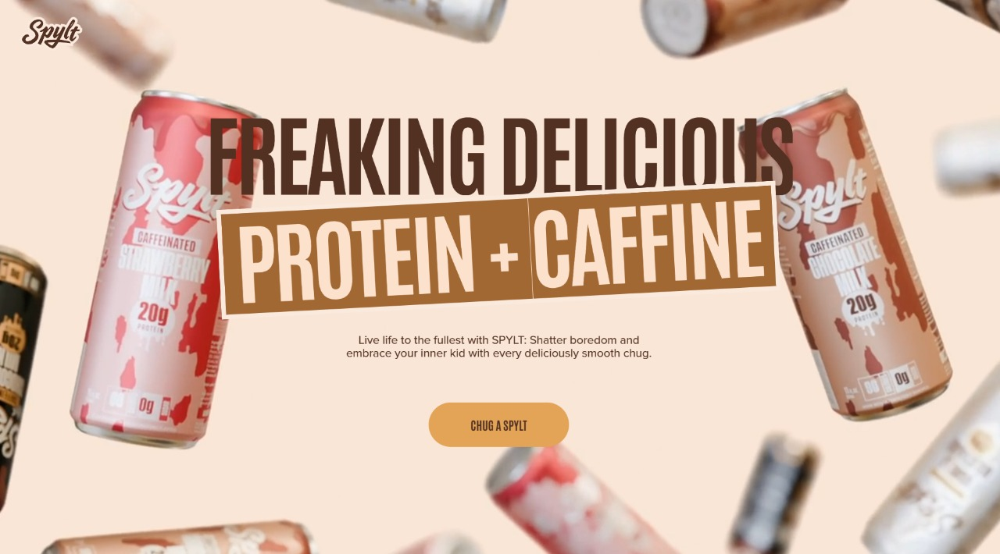

# Spylt - GSAP Animated Experience



## Overview

This project is a modern, high-performance landing page built for **Spylt**, focusing on delivering an immersive user experience through advanced animations and smooth interactions. 

I built this to push the boundaries of web animation using **GSAP (GreenSock Animation Platform)** combined with the power of **React 19** and the styling flexibility of **Tailwind CSS v4**. The goal was to create a site that feels alive, responsive, and worthy of an Awwwards mention.

## 🛠 Tech Stack

- **React 19**: For a robust component-based architecture.
- **Tailwind CSS v4**: For rapid, modern styling and responsive design.
- **GSAP (GreenSock)**: The core engine behind the complex scroll animations, parallax effects, and smooth transitions.

## ✨ Key Features

- **Scroll-Driven Animations**: Utilizing GSAP ScrollTrigger for immersive storytelling as you scroll.
- **Parallax Effects**: Depth and motion that bring the layout to life.
- **Responsive Design**: Fully optimized for mobile, tablet, and desktop experiences.
- **Interactive UI**: Custom cursors, hover effects, and dynamic content reveals.
- **Video Integration**: Seamless video backgrounds and pinned video sections.

## 🚀 Getting Started

If you want to run this project locally, follow these steps:

1.  **Clone the repository**
    ```bash
    git clone https://github.com/sandesh-sapkota/spylt-site.git
    ```

2.  **Install dependencies**
    ```bash
    npm install
    # or
    yarn
    ```

3.  **Run the development server**
    ```bash
    npm run dev
    # or
    yarn dev
    ```

4.  Open your browser and navigate to `http://localhost:5173` (or the port shown in your terminal).

---
***Made with love and a lot of coffee.❣️***
